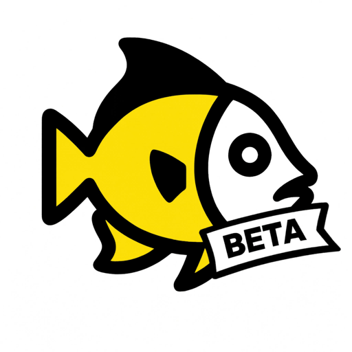

# Betafish

The beta channel for [Barberfish](https://github.com/jpweytjens/barberfish), data field enhancements for the Hammerhead Karoo.

Releases here are beta builds. They carry new features before those reach a stable release, and they are less tested: expect rough edges, and now and then something broken. If you just want Barberfish, the blue stable badge above takes you to the regular release.

## Install

1. On your phone, tap the orange beta button above.
2. Sideload the APK:
   * Karoo 3: share it to the Hammerhead companion app, following [Hammerhead's sideloading instructions](https://support.hammerhead.io/hc/en-us/articles/31576497036827-Karoo-Extension-Sideloading).
   * Karoo 2: install from a computer following [DC Rainmaker's instructions](https://www.dcrainmaker.com/2021/02/how-to-sideload-android-apps-on-your-hammerhead-karoo-1-karoo-2.html).

You only sideload once. A beta is the same app as Barberfish, so it replaces your stable install and your fields, HUD and settings carry over. From then on new betas show up as regular updates in the Karoo's extension manager. Stable users never see beta updates; you only join the channel by sideloading a build from here.

### Going back to stable

Android refuses to replace an app with an older version, so the current stable release won't install over a beta. Two ways back:

- Wait. When the features you are testing ship, the stable release lands here as the final update of the cycle and moves you back to the stable channel.
- Uninstall Barberfish, then grab the blue stable button above and sideload that APK the same way you installed the beta. This resets your Barberfish settings.

## What's in a beta

The [latest release](https://github.com/jpweytjens/Betafish/releases/latest) carries the full changelog for the version under test; the Karoo shows a short version of it with each update. What has shipped stable is tracked in the main repo's [changelog](https://github.com/jpweytjens/barberfish/blob/master/CHANGELOG.md).

## Feedback

Found something broken in a beta? [Open an issue](https://github.com/jpweytjens/Betafish/issues/new/choose) and mention the beta version and your Karoo model. Feature requests and stable-release bugs belong on the [main repo](https://github.com/jpweytjens/barberfish/issues).
